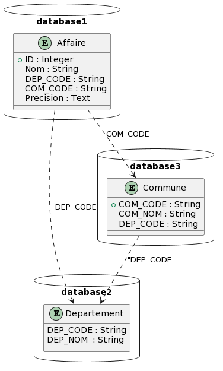

# Test Technique pour Développeur Fullstack

# Requirements

## Contexte

Ce test est conçu pour évaluer non seulement vos compétences techniques en développement d'applications web mais aussi votre capacité à structurer votre code, à aborder des problématiques complexes et à travailler en équipe. L'objectif n'est pas simplement de réussir le test mais de démontrer votre processus de réflexion, votre méthodologie de travail et votre collaboration au sein d'une équipe.

## Technologies

- **Backend** : Python Flask.
- **Frontend** : Libre.
- **Base de données** : Libre.
- **Environnement de développement** : Libre.

## Mission

Votre tâche consiste à développer une page web intégrant un formulaire dynamique lié à une base de données. Cette base doit inclure une entité "Affaire" au minimum, et le formulaire doit permettre de créer ou modifier une "Affaire" avec les éléments suivants :

1. **Nom de l'Affaire** : Champ pour saisir le nom.
2. **Lieu** : Champ de sélection dynamique comprenant :
   - Département
   - Commune
   - Précision (champ texte libre)

### Spécificités du Formulaire :

- **Relation Département/Commune** : Le choix des communes doit être filtré en fonction du département sélectionné, en vous basant sur le fichier de référence fourni (fr-esr-referentiel-geographique.csv).
- **Sélection du Lieu** :
  - **Mode Unique** : Permet l'ajout d'un seul lieu.
  - **Mode Multiple** : Permet d'ajouter ou de retirer des lieux dynamiquement.

### Objectifs Pédagogiques :

- **Structuration du Code** : Votre code doit être bien organisé, commenté et facile à comprendre.
- **Approche de la Problématique** : Nous sommes intéressés par la manière dont vous abordez et résolvez les défis proposés.
- **Travail d'Équipe** : Votre capacité à collaborer et à contribuer au sein d'une équipe est essentielle.

### Contraintes Techniques :

Le formulaire doit être intuitif et ergonomique, avec des transitions fluides entre les modes de sélection de lieu. Le bouton "Valider" enregistre les données, qui doivent être préchargées au rechargement de la page.

## Livrables

Nous attendons un code source clair et documenté, reflétant votre capacité à aborder des problèmes complexes et à travailler de manière collaborative. Montrez-nous votre processus de pensée et votre méthodologie de travail à travers votre code.

Votre approche pour relever ce défi nous intéresse autant que le résultat final. Bonne chance !

# Implementation

## Data base structure

## Database Technologies 🛢️

This project leverages a robust set of technologies for managing and querying data effectively. Below is a detailed overview of each technology used:

### PostgreSQL 🐘

**PostgreSQL** is a powerful, open source object-relational database system. It has more than 15 years of active development and a proven architecture that has earned it a strong reputation for reliability, feature robustness, and performance.

- **Website**: [PostgreSQL](https://www.postgresql.org/)
- **Main Features**:
  - Support for advanced data types
  - Full support for relational SQL queries
  - Extensive indexing techniques for high performance

### SQLAlchemy 🛠️

**SQLAlchemy** is a SQL toolkit and Object-Relational Mapping (ORM) system for the Python programming language. It gives application developers the full power and flexibility of SQL.

- **Website**: [SQLAlchemy](https://www.sqlalchemy.org/)
- **Main Features**:
  - High-level ORM for Python applications
  - Low-level SQL expression language
  - Engineered to efficiently work with large databases

### Alembic 🕰️

**Alembic** is a lightweight database migration tool for use with SQLAlchemy. It allows for version control of database schema changes.

- **Website**: [Alembic](https://alembic.sqlalchemy.org/)
- **Main Features**:
  - Database schema migrations
  - Generation of migration scripts
  - Database schema versioning

### PlantUML 🌱

**PlantUML** is a tool allowing users to create UML diagrams from a plain text language. It is particularly useful for designing and visualizing database schemas and architectures.

- **Website**: [PlantUML](https://plantuml.com/)
- **Main Features**:
  - Supports multiple UML diagram types
  - Integrates with other documentation tools
  - Text-based script for diagrams allows version control

These technologies are integrated to provide a seamless and efficient environment for database management and application development.
