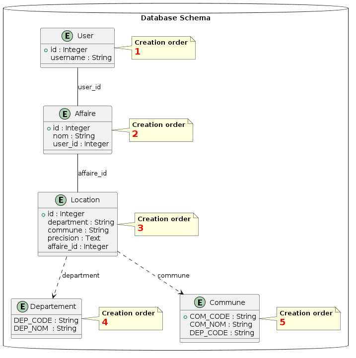

## Data base structure

## Database Technologies 🛢️

This project leverages a robust set of technologies for managing and querying data effectively. Below is a detailed overview of each technology used:

### PostgreSQL 🐘

**PostgreSQL** is a powerful, open source object-relational database system. It has more than 15 years of active development and a proven architecture that has earned it a strong reputation for reliability, feature robustness, and performance.

- **Website**: [PostgreSQL](https://www.postgresql.org/)
- **Main Features**:
  - Support for advanced data types
  - Full support for relational SQL queries
  - Extensive indexing techniques for high performance

### SQLAlchemy 🛠️

**SQLAlchemy** is a SQL toolkit and Object-Relational Mapping (ORM) system for the Python programming language. It gives application developers the full power and flexibility of SQL.

- **Website**: [SQLAlchemy](https://www.sqlalchemy.org/)
- **Main Features**:
  - High-level ORM for Python applications
  - Low-level SQL expression language
  - Engineered to efficiently work with large databases

### Alembic 🕰️

**Alembic** is a lightweight database migration tool for use with SQLAlchemy. It allows for version control of database schema changes.

- **Website**: [Alembic](https://alembic.sqlalchemy.org/)
- **Main Features**:
  - Database schema migrations
  - Generation of migration scripts
  - Database schema versioning

### PlantUML 🌱

**PlantUML** is a tool allowing users to create UML diagrams from a plain text language. It is particularly useful for designing and visualizing database schemas and architectures.

- **Website**: [PlantUML](https://plantuml.com/)
- **Main Features**:
  - Supports multiple UML diagram types
  - Integrates with other documentation tools
  - Text-based script for diagrams allows version control

These technologies are integrated to provide a seamless and efficient environment for database management and application development.
